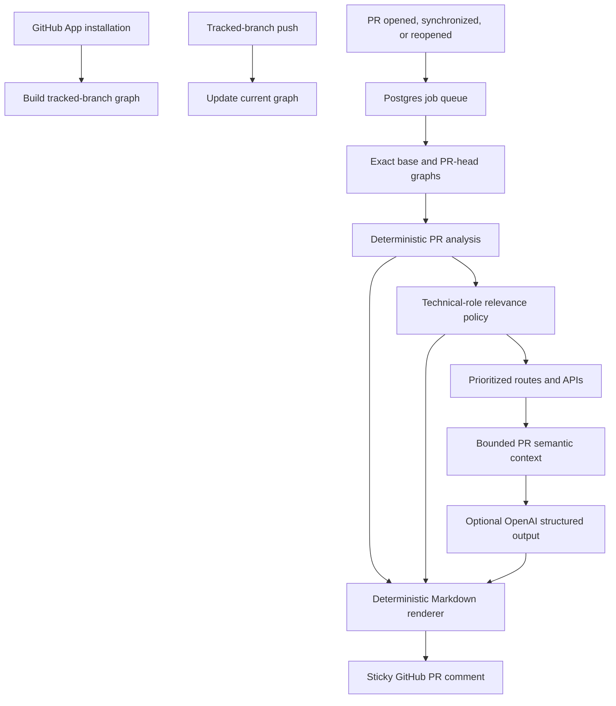

# Impact Analysis

**Impact Analysis is an evidence-first GitHub App for pull-request review.**
It posts one sticky GitHub comment that tells a developer which product areas
deserve verification before merging—and shows the resolved dependency evidence
behind every reachability claim.

It does **not** claim that a regression exists, generate a code review, replace
CI, or invent user journeys. Deterministic source analysis proves what can be
reached; optional AI only turns bounded, cited PR context into readable
summaries and suggested checks.

## Contents

- [What it does](#what-it-does)
- [How a report is produced](#how-a-report-is-produced)
- [Evidence and AI boundaries](#evidence-and-ai-boundaries)
- [Supported repositories](#supported-repositories)
- [Local setup](#local-setup)
- [GitHub App configuration](#github-app-configuration)
- [Configuration](#configuration)
- [Commands](#commands)
- [Deployment](#deployment)
- [Operations and troubleshooting](#operations-and-troubleshooting)
- [Limitations](#limitations)

## What it does

When the App is installed on a repository, it indexes the repository's default
branch. Later, a push to that tracked branch refreshes the graph. When a pull
request targets that branch, Impact Analysis compares the exact base and head
SHAs and posts or updates one comment on the PR.

The comment has four useful layers:

1. **What changed** — a concise, source-cited summary of changed code.
2. **Primary verification** — routes or APIs reached by changed application
   code or changed entrypoints.
3. **Secondary verification** — routes reached through changed presentation or
   utility code.
4. **Technical impact and evidence** — connected analytics, styling, UI
   primitives, infrastructure, configuration, unknown modules, changed symbols,
   unresolved imports, SHAs, and resolved dependency paths.

The visible recommendation is intentionally smaller than the underlying graph.
For example, a shared Button or analytics hook may technically reach many pages,
but it is shown as technical impact rather than prompting a developer to test
every customer flow.

## How a report is produced



### 1. Index the tracked branch

The App receives `installation` and `installation_repositories` events. For
each added repository, it discovers the default branch, fetches its source at
an exact commit SHA, and builds a repository graph.

The graph includes:

- workspace projects and package roots;
- files, symbols, static imports, style imports, local assets, and unresolved
  imports;
- reverse file-import edges;
- framework-proven routes and HTTP handlers;
- statically proven tRPC client-to-server bindings;
- a conservative technical role for each module.

Every later push to the tracked branch creates a new snapshot identity and
updates the materialized current graph. It reuses unchanged graph facts when
incremental analysis is safe and falls back to a full exact-SHA build when it
is not.

### 2. Analyze an exact pull request

For `opened`, `synchronize`, and `reopened` PR events, the App only analyzes
PRs whose base branch is the repository's tracked branch.

It compares the exact Git base and head SHAs, identifies changed files and
top-level symbols, then traverses only **resolved reverse file-import edges**.
The graph is the authority for reachability. PR branch graphs are constructed
in memory and are never persisted as tracked-branch graph state.

### 3. Prioritize, rather than merely list, reachability

Each changed seed is classified conservatively and routes/APIs are deduplicated
at their highest applicable tier:

| Tier | Deterministic rule |
|---|---|
| Primary | Changed route/API, or changed `application` code reaching a route/API. |
| Secondary | Changed `presentation` or `utility` code reaching a route/API. |
| Technical-only | Analytics, infrastructure, styling, configuration, testing, or UI primitive changes. |
| Evidence-only | Unknown/unsupported code; retain evidence without a verification task. |

This policy changes prominence, never the facts retained in the analysis.

### 4. Render and deliver one comment

The report is stored separately from raw deterministic analysis. A mutable
delivery record points to exactly one GitHub timeline comment per repository
and PR, so a later commit updates the same comment rather than creating noise.

Older delivery jobs cannot overwrite a newer PR head.

## Evidence and AI boundaries

### Deterministic evidence

The system persists and renders only evidence it can prove from the exact
source revision:

- changed files and top-level symbols;
- technical roles and the policy reason for each tier;
- affected routes/APIs;
- resolved dependency paths;
- base/head SHAs and unresolved-import counts.

A dependency path proves that a file depends on another file. It does **not**
prove that a particular imported symbol is used at runtime. Reports therefore
never make that stronger claim.

### Optional OpenAI assistance

AI assistance is enabled per repository by default. It receives one bounded,
PR-scoped packet after deterministic analysis has already selected the allowed
targets.

The packet can include:

- up to 12 locally calculated changed hunks, each capped at 4,000 characters;
- up to five prioritized routes or APIs;
- at most six selected local files per target, taken from the entrypoint and
  its verified dependency path;
- context IDs, source paths, blob SHAs, and line ranges for auditability.

Before any OpenAI request, the App excludes environment files, secrets,
lockfiles, generated output, dependencies, scripts, migrations, configuration,
and database source. It never uploads a repository wholesale, builds feature
cards, uses embeddings, or performs background AI indexing.

The model must return strict structured JSON. It may summarize supplied hunks
and suggest product-facing verification scenarios only for the already-proven
targets. Every suggestion must cite supplied hunk and source-context IDs.
Unknown IDs, malformed output, duplicate targets, implementation/CI-oriented
checks, and unsupported recommendations are rejected.

If OpenAI is disabled, unavailable, rate-limited, or returns invalid output,
the deterministic analysis and sticky comment still complete. The report shows
that semantic guidance was unavailable and does not fabricate scenarios.

Disable or enable AI assistance for a repository with:

```sh
pnpm set-ai-assistance -- <repoId> <true|false>
```

## Supported repositories

Impact Analysis supports JavaScript and TypeScript source graphs for standalone
packages and npm, Yarn, and pnpm workspaces. Turborepo and Nx are recognized as
workspace signals. Local workspace-package imports are resolved; external
packages remain external and are never fetched from `node_modules`.

| Profile | Proven facts | User-facing verification targets |
|---|---|---|
| Next.js | App/Pages routes and route handlers | Pages and API handlers |
| React Router | Literal JSX and route-object registrations | Proven client routes |
| Remix | `app/routes` conventions | Route and resource handlers |
| Express | Literal HTTP registrations and mounted local routers | HTTP handlers |
| tRPC | Static procedures and client hook calls | UI routes only when a client/server binding is proven |
| Other JS/TS | Modules, symbols, imports, roles, styles | Graph-only evidence |

When auto-detection is ambiguous, commit an `impact-analysis.config.json` to
select project roots and adapters. It cannot manually declare routes,
dependencies, or impact claims.

```json
{
  "projects": [
    { "root": "apps/web", "adapter": "react_router", "protocols": ["trpc"] },
    { "root": "apps/api", "adapter": "express", "protocols": ["trpc"] }
  ]
}
```

## Local setup

### Prerequisites

- Node.js 24 (the project is currently verified with Node 24).
- pnpm 10.
- Docker Desktop for local Postgres, or a reachable PostgreSQL database.
- A GitHub App and its private key.
- An OpenAI API key for semantic guidance. The deterministic fallback works
  without one, but no AI-generated verification scenarios will be available.

### 1. Install dependencies

```sh
pnpm install --frozen-lockfile
```

### 2. Create local configuration

```sh
cp .env.example .env
```

Set the values described in [Configuration](#configuration). Keep `.env` out
of source control.

### 3. Start Postgres and apply the schema

```sh
pnpm db:docker:init
```

This starts the local Docker Postgres instance, waits for it to become healthy,
and runs the clean baseline migration.

> The current migration history is intentionally a clean baseline. Do not use
> it to migrate a database from an older experimental schema; create a fresh
> development database instead.

### 4. Start the application

```sh
pnpm dev
```

This one process starts Express, all queue consumers, and the five-minute
tracked-branch reconciler. Do **not** start a separate worker process.

Confirm the process is running:

```sh
curl http://localhost:3000/health
```

Expected response:

```json
{ "status": "ok" }
```

`/health` is a liveness endpoint; it confirms the Node process is running, not
that Postgres or GitHub credentials are currently reachable.

### 5. Configure the GitHub App

Use the settings in [github-app/manifest.md](github-app/manifest.md).

For local development, GitHub needs a public HTTPS route to your machine. Use
your preferred temporary tunnel and set its target to:

```text
http://localhost:3000/webhooks/github
```

For a hackathon demo, keep the GitHub App private and install it only on your
own demo repositories. A public webhook URL does not require a public App.

### 6. Verify the first end-to-end flow

1. Install the App on a selected repository.
2. Check that an `installation.sync` job is recorded and a tracked-branch
   graph snapshot becomes ready.
3. Open a PR into the repository's default branch.
4. Wait for the sticky **Change Impact Report** comment.
5. Push another commit to that PR and verify the same comment updates.

## GitHub App configuration

Configure the App with the following minimum permissions and events:

| Type | Setting |
|---|---|
| Repository permission | Metadata: read-only |
| Repository permission | Contents: read-only |
| Repository permission | Pull requests: read and write |
| Webhook event | `installation` |
| Webhook event | `installation_repositories` |
| Webhook event | `push` |
| Webhook event | `pull_request` |

The pull-request write permission is necessary for the sticky timeline
comment. The App does not currently use GitHub Checks, so it should not request
that permission.

Set the webhook URL to:

```text
https://<your-public-host>/webhooks/github
```

Set a long, random webhook secret in both GitHub and
`GITHUB_WEBHOOK_SECRET`. The server stores the original request body and
verifies GitHub's SHA-256 signature before processing a delivery.

## Configuration

| Variable | Required | Purpose |
|---|---:|---|
| `PORT` | No | HTTP port; defaults to `3000`. |
| `LOG_LEVEL` | No | Minimum structured-log level; defaults to `info`. |
| `DATABASE_URL` | Yes | PostgreSQL connection string. |
| `GITHUB_APP_ID` | Yes | GitHub App ID used to issue installation tokens. |
| `GITHUB_WEBHOOK_SECRET` | Yes | Secret used to verify incoming GitHub deliveries. |
| `GITHUB_PRIVATE_KEY_PATH` | Yes | Filesystem path to the GitHub App private-key PEM file. |
| `OPENAI_API_KEY` | Recommended | Enables bounded semantic verification guidance. |
| `OPENAI_MODEL` | No | Model identifier; defaults to `gpt-5.6-luna`. |

For a hosted environment, mount the GitHub private key as a secret file and
set `GITHUB_PRIVATE_KEY_PATH` to that mounted path. Never commit the PEM file,
webhook secret, database URL, or OpenAI key.

## Commands

| Command | Purpose |
|---|---|
| `pnpm dev` | Run the local single service with file watching. |
| `pnpm build` | Type-check and compile TypeScript to `dist/`. |
| `pnpm start` | Run the compiled single service. Run `pnpm build` first. |
| `pnpm test` | Run all fixture, semantic-safety, delivery, and reliability tests. |
| `pnpm db:docker:init` | Start local Docker Postgres and apply migrations. |
| `pnpm db:docker:down` | Stop local Docker Postgres without deleting its volume. |
| `pnpm db:generate` | Generate a Drizzle migration after schema changes. |
| `pnpm db:migrate` | Apply pending migrations. |
| `pnpm reliability:status` | Print queue, graph, project, stale-branch, and recent PR delivery status. |
| `pnpm set-ai-assistance -- <repoId> <true|false>` | Enable or disable OpenAI-assisted guidance for one repository. |

## Deployment

The initial deployment uses **one always-on Node service plus PostgreSQL**. The
service embeds the HTTP endpoint and durable job workers. Postgres is both the
source of durable state and the job queue; Redis, SQS, and a second worker
deployment are not required for the hackathon version.

### Render configuration

Use these settings:

```text
Build command: pnpm install --frozen-lockfile && pnpm build
Start command: node dist/src/server/index.js
Health check path: /health
```

Set all production environment variables in Render's secret configuration.
The private key must be mounted or written as a protected file because this
application reads it from `GITHUB_PRIVATE_KEY_PATH`.

Run `pnpm db:migrate` once against the fresh production database before
receiving live webhooks. Do **not** run development Docker reset commands
against production data.

### Deployment acceptance checklist

Before sharing the demo:

- `GET /health` returns 200.
- GitHub's webhook-delivery page shows a 202 response for each supported event.
- Installing the App creates a ready graph snapshot for the default branch.
- A tracked-branch push advances the current graph SHA.
- A PR creates one analysis, one report, and one sticky comment.
- A new PR commit updates that same comment.
- An OpenAI failure leaves a truthful deterministic report and visible semantic
  guidance status.
- `pnpm reliability:status` shows no unexpected pending or failed jobs.

## Reliability and recovery

Jobs are persisted before they are processed. Duplicate webhook deliveries use
idempotency keys, and workers use database leases so a late or crashed worker
cannot complete a job it no longer owns.

Transient failures—network errors, GitHub/OpenAI rate limits, provider 5xx
responses, database connection failures, and deadlines—receive at most three
total attempts: the initial attempt, then retries after approximately 30
seconds and two minutes. Invalid payloads, unsupported source profiles,
inactive repositories, and ordinary authorization/not-found failures are
terminal rather than retried.

The reconciler runs every five minutes. It compares each active tracked branch
with GitHub's live SHA and queues a full rebuild when a push was missed or the
current graph is stale.

## Operations and troubleshooting

### No graph after installation

Check, in order:

1. The GitHub App is installed on the intended repository.
2. The App subscribes to `installation` and `installation_repositories`.
3. The webhook delivery returned 202 and the signature secret matches.
4. The service process is still running; it embeds the worker automatically.
5. `pnpm reliability:status` shows whether `installation.sync` is pending,
   retried, or terminally failed.
6. The App has Contents read permission and its private key/App ID are valid.

### A PR gets no comment

The PR must use `opened`, `synchronize`, or `reopened` and target the tracked
branch. Also verify that the App has Pull requests read/write permission, that
the repository remains active, and that `pull_request.analyze` and
`pull_request.deliver` jobs completed.

### The comment shows no concrete verification scenarios

This is expected when AI assistance is disabled/unavailable, when the PR has
insufficient source evidence, or when no affected prioritized route has a
proven interaction/state/test anchor. The report retains deterministic paths
instead of inventing a scenario.

### A repository has no user-facing verification target

The generic JS/TS graph may be healthy while route detection is intentionally
limited. Dynamic routers, remote route configuration, arbitrary route-array
mapping, feature-flag route construction, generated routes, and unbound tRPC
procedures remain graph-only evidence until a dedicated adapter can prove the
entrypoint or protocol binding.

## Limitations

- One tracked branch is maintained per repository; installation selects the
  repository's default branch.
- The App supports JavaScript/TypeScript source analysis only.
- Import reachability is not a call graph, runtime trace, test result, security
  review, or code-quality review.
- Framework composition that is not expressed through imports is not inferred.
- Dynamic/custom routing is deliberately not guessed.
- tRPC procedures reach UI verification targets only when a static client/server
  binding is proven.
- AI suggestions are not correctness claims and are never allowed to establish
  reachability.
- Uninstalling or removing a repository makes it inactive; a production data
  retention/purge policy is still required before broad public availability.
- The combined service is intentionally a one-replica hackathon deployment.
  Split web and worker startup before horizontally scaling the web process.

## Project structure

```text
src/
  github/       Webhook verification, event handlers, PR-comment writer
  graph/        Source retrieval, project discovery, graph builder, adapters
  impact/       Exact PR diff/graph analysis and impact policy
  queue/        Durable Postgres queue, leases, retries, reconciliation
  report/       Bounded semantic context, validation, Markdown rendering
  delivery/     Sticky-comment state and delivery jobs
  storage/      Drizzle schema and repository access
  worker/       Embedded queue consumers and tracked-branch reconciler
  server/       Express entrypoint and structured logging
scripts/        Tests, database initialization, and operator CLIs
docs/           Architecture, JS/TS support, and implementation plan
github-app/     Required GitHub App permissions and event subscriptions
```

## Further reading

- [Architecture](docs/ARCHITECTURE.md)
- [JavaScript/TypeScript support](docs/JS_TS_SUPPORT.md)
- [Phase plan](docs/PHASE_PLAN.md)
- [GitHub App permissions](github-app/manifest.md)
