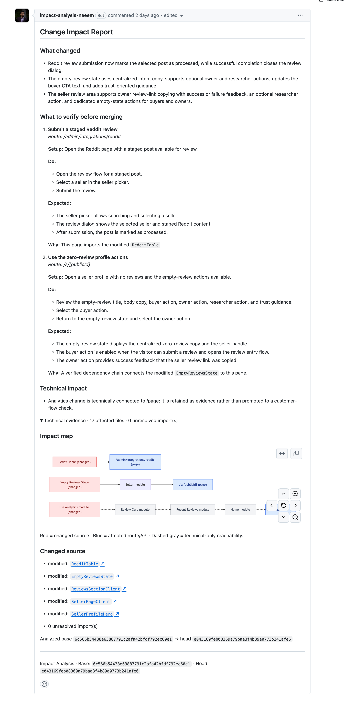
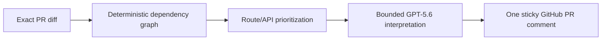

# Impact Analysis

> **Know what to verify before merging.**

Impact Analysis is an evidence-first GitHub App for pull-request review. It
traces a PR through a JavaScript/TypeScript dependency graph, identifies the
routes and APIs that can be reached, and posts one sticky GitHub comment with
prioritized, source-grounded verification guidance.

It is built for the **OpenAI Build Week — Developer Tools** track with Codex
and GPT-5.6.

[Live landing page](https://impact-analysis-yiyj.onrender.com) ·
[Architecture](docs/ARCHITECTURE.md) ·
[GitHub App setup](github-app/manifest.md)

<p align="center">
  <a href="images/PR-2.png"></a>
</p>

## The problem

CI can confirm that a pull request builds. A diff can show which files changed.
Neither tells a reviewer which product behavior deserves manual verification
before merge.

For a shared component, helper, analytics hook, or API procedure, a long list
of importers is technically correct but rarely useful. Impact Analysis answers
the more practical question:

> **Given this change, what should a developer check before merging—and why?**

## What it does



Every report has two clearly separated layers:

1. **Product-facing guidance** — what changed and the routes or APIs worth
   checking before merge.
2. **Technical evidence** — changed symbols, module roles, exact resolved
   dependency paths, source links, SHAs, and unresolved-import information.

The graph is the authority for reachability. GPT-5.6 can explain only the
bounded PR code context it is given; it cannot add routes, invent dependencies,
claim that a regression exists, or replace CI.

### What a developer sees

- **What changed** — concise summaries grounded in exact changed hunks.
- **Primary verification** — changed application behavior or direct route/API
  changes that reach product entrypoints.
- **Secondary verification** — presentation or utility changes that reach an
  entrypoint.
- **Technical impact** — analytics, styling, infrastructure, configuration,
  tests, and reusable UI primitives; preserved as evidence without asking
  developers to retest every product flow.
- **Expandable impact map** — an auditable graph rather than a wall of paths.

## Why it is different

| Typical PR summary | Impact Analysis |
|---|---|
| Explains a diff | Connects a change to statically proven routes and APIs |
| May imply impact from semantic context | Uses resolved imports as the reachability authority |
| Treats every importer alike | Applies a deterministic role policy to reduce shared-code noise |
| Produces a new review artifact | Updates one sticky comment on the existing pull request |

Impact Analysis does **not** claim to find bugs, prove runtime behavior,
replace tests, perform a code-quality review, or infer user workflows that are
not supported by the supplied source evidence.

## Built with Codex and GPT-5.6

Codex was the primary engineering collaborator for the project: it accelerated
the system architecture, repository graph engine, framework adapters, durable
queue reliability, GitHub integration, report safety rules, tests, deployment
documentation, and the landing page.

The product uses GPT-5.6 through the OpenAI Responses API after deterministic
analysis has completed. A single PR-scoped request receives only selected
changed hunks and exact route context. Strict structured output and local
validation ensure that the model can summarize supplied changes and phrase
verification checks, but can never establish reachability itself.

For the Devpost submission, include the required Codex `/feedback` session ID
and a public, narrated demonstration video showing the real end-to-end
workflow.

## Judge and demo path

The deployed service hosts a product overview and real report examples at
[impact-analysis-yiyj.onrender.com](https://impact-analysis-yiyj.onrender.com).
Open either report image to inspect the full sticky-comment output.

The GitHub App is deliberately **private** for the hackathon and installed only
on controlled demonstration repositories. This prevents arbitrary installations
from triggering source retrieval or OpenAI usage. In the Devpost submission,
link the public video and a demonstration PR that show installation, a report
appearing on a real PR, and the same comment updating after a follow-up commit.

To run your own interactive instance, follow [Local setup](#local-setup),
create a GitHub App with the documented permissions, and install it on a
repository you control.

## Supported repositories

Impact Analysis builds deterministic source graphs for standalone JavaScript
and TypeScript projects plus npm, Yarn, and pnpm workspaces. Turborepo and Nx
are recognized as workspace signals. Local workspace packages resolve normally;
external dependencies are never fetched from `node_modules`.

| Profile | Proven entrypoints and bindings |
|---|---|
| Next.js | App Router and Pages Router routes, route handlers, layouts as composition evidence |
| React Router | Literal JSX/route-object route registrations and literal lazy imports |
| Remix | Conventional `app/routes`, route handlers, loaders, and actions |
| Express | Literal HTTP registrations and mounted local routers |
| tRPC | Static procedures and client hooks, only linking to UI when the client/server binding is proven |
| Other JS/TS | Deterministic modules, symbols, imports, styles, and roles; graph-only evidence until an entrypoint adapter is available |

Dynamic route construction, remote configuration, arbitrary route-array
mapping, generated routes, custom routers, and unbound tRPC procedures are not
guessed. They remain explicit graph-only or insufficient-evidence results.

When auto-detection is ambiguous, commit `impact-analysis.config.json` to
select project roots and adapters; it cannot manually declare routes or
dependencies.

```json
{
  "projects": [
    { "root": "apps/web", "adapter": "react_router", "protocols": ["trpc"] },
    { "root": "apps/api", "adapter": "express", "protocols": ["trpc"] }
  ]
}
```

## Local setup

### Prerequisites

- Node.js 24 and pnpm 10.
- Docker Desktop for local Postgres, or a reachable PostgreSQL database.
- A GitHub App private key and webhook secret.
- An OpenAI API key for AI-assisted scenarios. The deterministic graph and
  report fallback work without one.

### Run the application

```sh
pnpm install --frozen-lockfile
cp .env.example .env
pnpm db:docker:init
pnpm dev
```

The single `pnpm dev` process starts Express, durable queue consumers, and the
five-minute tracked-branch reconciler. Do not run a separate worker process.

Confirm the HTTP process is alive:

```sh
curl http://localhost:3000/health
# {"status":"ok"}
```

`/health` is a liveness check only; it does not guarantee live database,
GitHub, or OpenAI connectivity.

### Configure GitHub

Use [github-app/manifest.md](github-app/manifest.md). The required repository
permissions are Metadata read-only, Contents read-only, and Pull requests
read/write. Subscribe to `installation`, `installation_repositories`, `push`,
and `pull_request`.

For local webhook development, expose this endpoint through an HTTPS tunnel:

```text
http://localhost:3000/webhooks/github
```

### Verify the end-to-end flow

1. Install the App on a selected repository.
2. Wait for the initial tracked-branch graph to become ready.
3. Open a PR into the tracked branch.
4. Wait for the sticky **Change Impact Report** comment.
5. Push another commit and confirm that the same comment updates.

The fixture suite supplies deterministic sample repositories and expected
graph/report output for non-GitHub testing:

```sh
pnpm test
```

## Configuration

| Variable | Required | Purpose |
|---|---:|---|
| `PORT` | No | HTTP port; defaults to `3000`. |
| `LOG_LEVEL` | No | Minimum JSON log level; defaults to `info`. |
| `DATABASE_URL` | Yes | PostgreSQL connection string. |
| `GITHUB_APP_ID` | Yes | GitHub App ID used to issue installation tokens. |
| `GITHUB_WEBHOOK_SECRET` | Yes | Verifies GitHub webhook signatures. |
| `GITHUB_PRIVATE_KEY_PATH` | Yes | Mounted path to the GitHub App private-key PEM. |
| `OPENAI_API_KEY` | Recommended | Enables PR semantic guidance. |
| `OPENAI_MODEL` | No | Defaults to `gpt-5.6-luna`. |

Never commit the PEM file, webhook secret, database URL, or OpenAI key.

AI assistance is enabled per repository by default. Disable it with:

```sh
pnpm set-ai-assistance -- <repoId> false
```

When it is disabled or unavailable, reports still provide deterministic
reachability, priorities, source links, and technical evidence; they simply do
not fabricate AI-generated verification scenarios.

## Commands

| Command | Purpose |
|---|---|
| `pnpm dev` | Run the local service with file watching and embedded workers. |
| `pnpm build` | Type-check and compile to `dist/`. |
| `pnpm start` | Run the compiled service. Run `pnpm build` first. |
| `pnpm test` | Run all fixture, semantic-safety, delivery, and reliability tests. |
| `pnpm db:docker:init` | Start local Docker Postgres and apply migrations. |
| `pnpm db:docker:down` | Stop local Docker Postgres without deleting its volume. |
| `pnpm db:generate` | Generate a Drizzle migration after schema changes. |
| `pnpm db:migrate` | Apply pending migrations. |
| `pnpm reliability:status` | Show queue, graph, stale-branch, and delivery health. |
| `pnpm set-ai-assistance -- <repoId> <true|false>` | Change repository-level OpenAI assistance. |

## Deploying the hackathon version

Impact Analysis deploys as **one always-on Node service plus PostgreSQL**. The
HTTP server and durable workers run together; Postgres also holds queue state,
so no Redis, SQS, or second worker service is required for the demo.

For Render:

```text
Build command: pnpm install --frozen-lockfile && pnpm build
Start command: node dist/src/server/index.js
Health check: /health
```

Set all production variables as secrets, mount the GitHub private key at the
path configured by `GITHUB_PRIVATE_KEY_PATH`, and run `pnpm db:migrate` once
against the fresh production database before accepting webhooks.

Before a demo, verify that:

- `/health` returns HTTP 200;
- GitHub delivers supported webhooks with HTTP 202;
- installation builds a graph for the tracked branch;
- a PR creates one analysis, report, and sticky comment;
- a new commit updates the same comment; and
- `pnpm reliability:status` shows no unexpected failed jobs.

## Limits and honest boundaries

- One tracked branch is maintained per repository.
- JavaScript/TypeScript is the supported language scope.
- Import reachability is not a call graph, runtime trace, test result, or
  security review.
- Framework composition not expressed through imports is not inferred.
- AI never establishes reachability or claims breakage.
- The embedded-worker deployment is intentionally one replica for the
  hackathon; web and worker processes should be split before horizontal scale.

## Documentation

- [Architecture](docs/ARCHITECTURE.md) — system boundaries, data flow,
  persistence, reliability, and security decisions.
- [JS/TS support](docs/JS_TS_SUPPORT.md) — framework adapter support and
  explicit static-analysis limits.
- [GitHub App manifest](github-app/manifest.md) — permissions, events, and
  setup.
- [Phase plan](docs/PHASE_PLAN.md) — historical delivery roadmap and scope.

## License

[MIT](LICENSE)
