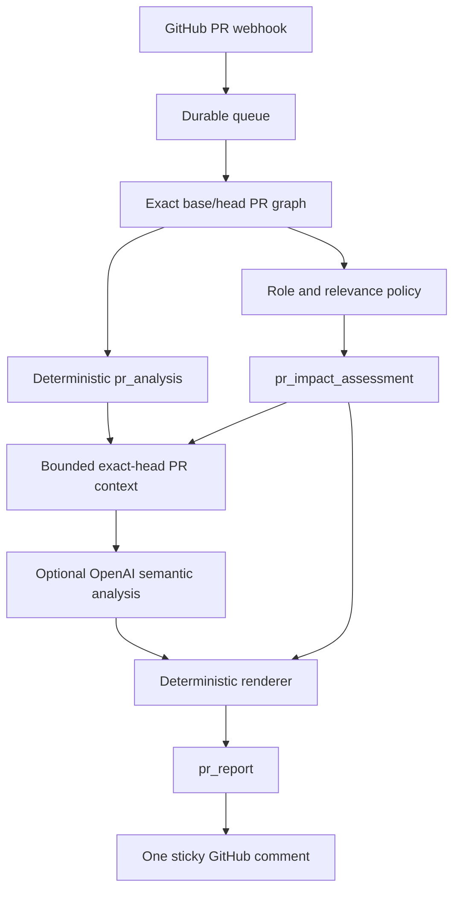
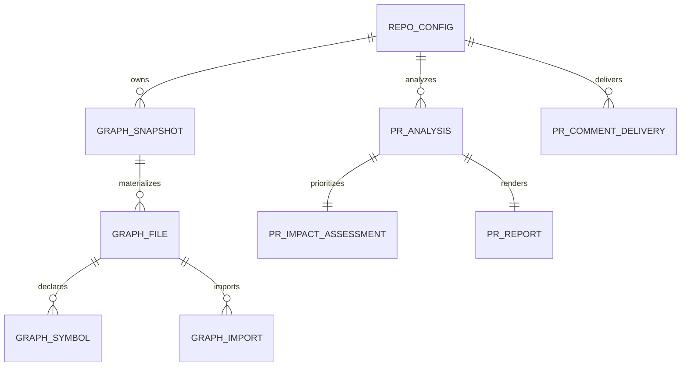

# Impact Analysis Architecture

## Product contract

The app tells a developer what deserves attention before merging. Every reachability claim is deterministic and backed by a resolved file-import path. AI may explain supplied code and phrase suggested checks; it never establishes impact.

## Lifecycle

### Installation and tracked-branch pushes

Installation and tracked-branch push workers only build or update the deterministic graph. They never send source to OpenAI and do not maintain feature summaries.

Each graph stores file kind, symbols, resolved imports, and a conservative technical role:

| Role | Meaning |
|---|---|
| `application` | Product-specific code without a stronger technical role. |
| `presentation` | Feature-specific component UI. |
| `utility` | Generic helper; still eligible for Secondary verification. |
| `ui_primitive` | Reusable visual primitive such as `components/ui/**`. |
| `analytics` | Telemetry or tracking. |
| `infrastructure` | Database, cache, transport, adapter, provider, or platform plumbing. |
| `styling`, `configuration`, `testing`, `unknown` | Special-purpose or unclassified code. |

Ambiguous source defaults to `application`; the system does not infer business labels such as Pricing or Payments from a filename.

### Pull request analysis

For a PR, the worker compares the exact base and head SHAs. It reuses the current tracked graph only when it matches the base SHA; otherwise it builds the base graph in memory. It then builds the exact head graph in memory. PR branch graphs are never persisted.

`pr_analysis` stores raw deterministic facts: changed files and symbols, all graph-reachable product items, one verified path for every item, unresolved imports, and insufficiency state.

The role policy reads roles from those exact ephemeral graphs and persists `pr_impact_assessment`:

| Tier | Rule |
|---|---|
| Primary | A directly changed page/API, or changed `application` code reaching a page/API. |
| Secondary | Changed `presentation` or `utility` code reaching a page/API. |
| Technical-only | Analytics, infrastructure, styling, configuration, testing, or UI primitive changes. |
| Evidence-only | A changed seed with no reliable role. |

Only pages and API routes are verification targets. A route appears once at its highest tier. Components and shared modules remain in technical evidence, not as duplicate user tasks.

## Optional PR semantic analysis

`repo_config.ai_assistance_enabled` defaults to true. It means:

> Allow bounded PR code context to be processed by OpenAI for suggested verification guidance. Deterministic graph evidence is unaffected.

When enabled, the report worker builds one PR-scoped source packet:

- Up to 12 locally calculated changed hunks, capped at 4,000 characters each.
- Up to five Primary/Secondary routes or APIs.
- For each target, at most six exact PR-head local files selected from the entrypoint and its verified dependency path.
- Context IDs, paths, blob SHAs, and line ranges for every excerpt.

Environment files, secrets, lockfiles, generated output, dependencies, scripts, migrations, configuration, and database source are excluded before any OpenAI request. There is no repository-wide upload, background indexing, feature card, vector store, or domain card.

OpenAI has one strict JSON task: summarize changed hunks and suggest at most three checks for each already-prioritized target. Every summary cites a hunk ID. Every check cites its target, hunk IDs, and source-context IDs. Unknown IDs, duplicate targets/checks, malformed output, and checks for non-prioritized targets are rejected.

If AI assistance is disabled or unavailable, the report still completes with deterministic changed-symbol summaries, generic route verification wording, and verified paths. It makes no invented workflow claims.

## Report and delivery

`pr_report` is a durable presentation artifact. It contains deterministic evidence, the bounded semantic input, validated semantic output when available, rendered Markdown, and safe provider metadata. It is separate from `pr_analysis`, so a model or delivery failure cannot rewrite graph facts.

The rendered comment contains:

1. What changed.
2. Primary verification.
3. Secondary verification.
4. Technical-only impact.
5. Complete technical evidence: paths, changed symbols, unresolved imports, and SHAs.

`pr_comment_delivery` is the only mutable delivery record. It points to one sticky GitHub PR comment and prevents stale jobs from overwriting newer PR-head reports.

## Storage model

The graph has one mutable materialized state per tracked repository branch. `graph_snapshot` keeps immutable metadata for each analyzed SHA; graph file/symbol/import facts move to the current snapshot. PR base/head graphs remain in memory.

## Operational boundaries

- The app supports one configured tracked branch per repository.
- Unsupported source profiles return insufficient evidence, never fabricated impact.
- GitHub/OpenAI failures use the queue reliability policy. A semantic failure produces a deterministic report fallback rather than blocking comment delivery.
- Logs contain IDs, counts, timing, status, and safe errors only. They never include source excerpts, report Markdown, tokens, secrets, or private keys.

## Clean database reset

The current migration history is intentionally one clean baseline: `0000_pr_scoped_semantic_impact.sql`. It is not compatible with prior feature-card tables or report rows. Recreate the development database, run `pnpm db:migrate`, reinstall repositories, and allow baseline graphs to rebuild.
