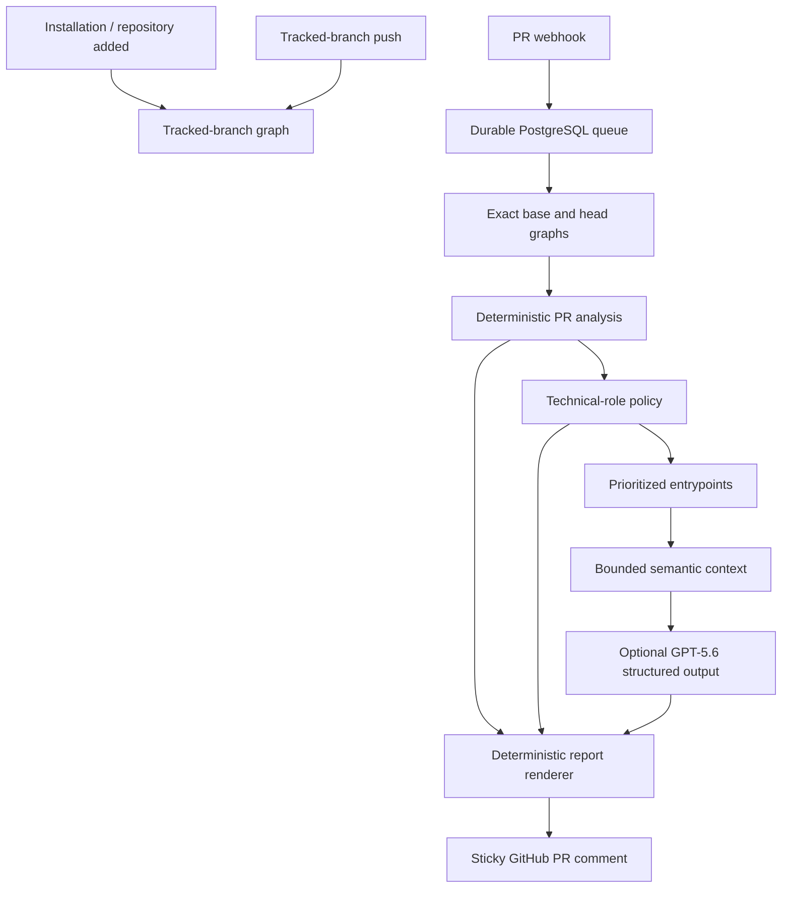
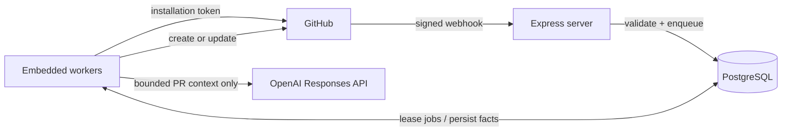
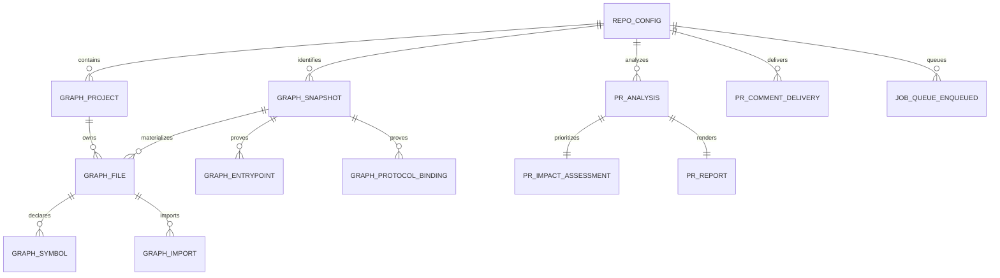

# Impact Analysis Architecture

## Purpose and document boundary

This document explains how the system works, what it can prove, and how it
recovers from failure. It is the engineering reference.

The [README](../README.md) is the product and judge entry point: value
proposition, live/demo access, supported repositories, local setup, deployment,
and commands. It intentionally does not duplicate the implementation detail
below.

## Product contract

Impact Analysis tells a developer which product entrypoints deserve attention
before a pull request merges. Each reachability claim is backed by an exact-SHA,
resolved file-import path.

The system does **not** claim that a regression exists, establish runtime
behavior, prove symbol-level use, replace CI, or infer dynamic routing. AI may
explain supplied code and phrase a suggestion, but never establishes impact.

## Runtime topology

The hackathon deployment is intentionally one always-on Node process plus
PostgreSQL. Express accepts webhooks quickly; embedded worker loops consume the
durable jobs independently. This keeps the infrastructure small without making
webhook processing synchronous.

The process starts these consumers exactly once:

- installation/repository synchronization;
- tracked-branch push update;
- branch reconciliation;
- pull-request analysis and report generation;
- sticky-comment delivery; and
- a five-minute tracked-branch reconciliation loop.

Before horizontally scaling the web process, split HTTP and worker startup so
only the worker deployment polls the queue.

## Deterministic repository graph

### Project discovery

At an exact commit SHA, source retrieval discovers standalone package roots and
npm, Yarn, or pnpm workspaces. Turborepo and Nx act as workspace signals. Each
source path belongs to its deepest project root.

A `ProjectDescriptor` captures the project root, package metadata,
`tsconfig.json`/`jsconfig.json` (or conservative JavaScript defaults),
framework profile, protocol profiles, and explicit unsupported/ambiguous
reason. A committed `impact-analysis.config.json` can select roots/adapters if
detection is ambiguous; it cannot declare manual graph or impact edges.

### Common graph facts

Every indexable JS/TS project contributes framework-neutral facts:

- modules for `.ts`, `.tsx`, `.mts`, `.cts`, `.js`, `.jsx`, `.mjs`, and `.cjs`;
- first-class stylesheet modules and local assets;
- top-level symbols and export information;
- static, dynamic, type-only, stylesheet, external, unresolved, and asset
  imports;
- local and workspace-package import resolution;
- reverse resolved file-import traversal; and
- a conservative technical role with a reason and classification strength.

External packages never become graph files and `node_modules` is never fetched.
Unresolved imports remain explicit rather than receiving fabricated targets.

### Framework and protocol adapters

Adapters add entrypoint semantics only where they can statically prove them:

| Adapter | Proven facts |
|---|---|
| Next.js | App/Pages routes, route handlers, layouts as composition evidence, metadata boundaries |
| React Router | Literal JSX and route-object registrations, nesting, literal lazy imports |
| Remix | Conventional routes, resource routes, loaders, and actions |
| Express | Literal method registrations, mounted local routers, and static prefixes |
| tRPC | Router procedures, static client calls, and client/server bindings only when both ends are proven |

Other indexable JS/TS applications still produce graph facts but no fabricated
user-facing entrypoint. Dynamic route registration, custom runtime routers,
remote configuration, arbitrary mapping, generated routes, and unknown
protocol bindings remain graph-only evidence.

### Technical roles

Each graph module has one required deterministic role:

| Role | Meaning |
|---|---|
| `application` | Product-specific behavior without a stronger technical role. |
| `presentation` | Feature-specific UI component. |
| `utility` | Generic helper; still eligible for Secondary verification. |
| `ui_primitive` | Reusable visual primitive, such as `components/ui/**`. |
| `analytics` | Telemetry, tracking, or metrics. |
| `infrastructure` | Database, cache, transport, adapter, provider, or platform plumbing. |
| `styling`, `configuration`, `testing`, `unknown` | Special-purpose or unclassified code. |

Ambiguous product code defaults to `application`, not a guessed business
category such as “pricing” or “payments.” This avoids suppressing potentially
important product changes based on naming alone.

## Graph lifecycle

### Installation and tracked branch

`installation` and `installation_repositories` create or reactivate repository
configuration and enqueue an installation sync. The baseline build reads the
configured default branch at one exact SHA, then creates snapshot metadata and
the branch’s materialized graph.

For a push to the tracked branch, the worker compares the old/new SHAs and
reanalyses changed files, reverse dependents, and imports that could resolve
because of added or renamed files. It falls back to a full exact-SHA build when
comparison is incomplete, configuration changes, or incremental safety is not
guaranteed.

There is one mutable materialized graph per repository/branch, while
`graph_snapshot` retains immutable identity and build metadata for each
analyzed SHA. A stale or out-of-order push cannot move the current graph
backwards.

### Pull requests

Only PRs targeting the configured tracked branch are analyzed. The PR worker:

1. Reuses the current branch graph only if its SHA exactly equals the PR base.
2. Otherwise builds the base graph in memory from the exact base SHA.
3. Builds the exact PR-head graph in memory; it is never persisted as
   tracked-branch graph state.
4. Compares changed modules and top-level symbols.
5. Traverses resolved reverse file-import edges to entrypoints.
6. Persists the raw deterministic analysis and the role-policy assessment.

An import path proves file-to-file dependency, not that an importer consumes a
specific symbol. The report uses neutral wording unless an AST anchor can prove
a stronger relationship such as a component render or a bound call site.

## Prioritization policy

`pr_analysis` preserves all deterministic graph facts. The separate
`pr_impact_assessment` is an auditable policy layer that only changes
prominence:

| Tier | Deterministic rule | User-facing result |
|---|---|---|
| Primary | Changed route/API, or changed `application` code reaching a route/API | Verification target |
| Secondary | Changed `presentation` or `utility` code reaching a route/API | Lower-priority verification target |
| Technical-only | Analytics, infrastructure, styling, configuration, testing, or UI primitive | Technical context; no broad customer-flow recommendation |
| Evidence-only | Unknown or unsupported source | Evidence only; no recommendation |

Each route/API appears once at its highest tier. All verified paths are
retained in evidence even when an item is not promoted to a visible check.

## Bounded PR semantic analysis

`repo_config.ai_assistance_enabled` defaults to `true`. It means:

> Allow bounded pull-request source context to be processed by OpenAI for
> suggested verification guidance. Deterministic graph evidence is unaffected.

After the graph and policy select allowed targets, the report worker prepares
one source packet. It can contain:

- up to 12 locally calculated changed hunks, each capped at 4,000 characters;
- at most five Primary/Secondary pages or APIs;
- at most six exact PR-head local files per target, selected from the
  entrypoint and a verified dependency path; and
- context IDs, paths, blob SHAs, and line ranges for every excerpt.

Environment files, secrets, lockfiles, generated output, dependencies,
scripts, migrations, configuration, and database source are excluded before an
OpenAI request. The system does not upload a repository wholesale, use vector
search, create feature cards, or perform background AI indexing.

The model receives a strict JSON schema. It may summarize cited changed hunks
and suggest at most three product-facing checks per already-prioritized target.
Each output must cite supplied hunk and context IDs. Unknown IDs, duplicate or
unsupported checks, CI/build/typecheck suggestions, malformed data, and
technical-only target scenarios are rejected locally.

If the provider is disabled, unavailable, rate-limited, or invalid, report
generation does not fail. The renderer writes a truthful deterministic fallback
and records the safe semantic failure status.

## Persistence model

The layers deliberately have different mutability:

| Record | Mutability | Reason |
|---|---|---|
| `graph_snapshot` | Immutable identity/build metadata per SHA | Audit which source revision was analyzed |
| Current graph facts | Mutable per tracked repository branch | Efficient current-branch updates |
| `pr_analysis` | Immutable | Preserve deterministic facts for a PR head SHA |
| `pr_impact_assessment` | Immutable | Preserve the policy decision that produced a report |
| `pr_report` | Immutable | Preserve the exact evidence, semantic packet/result, and Markdown |
| `pr_comment_delivery` | Mutable | Keep one GitHub comment pointer current for each PR |
| Queue jobs | Mutable lifecycle fields with fenced leases | Recover safely from worker loss/retries |

## Reliability and ordering

Webhook handlers verify the GitHub signature, record the event, and enqueue
quickly. They do not perform graph or model work synchronously.

Jobs have a fenced lease token and expiry. A completion, retry, or failure must
match the claiming lease, so an expired worker cannot overwrite a newer attempt.
Transient failures receive three total attempts with approximately 30-second
then two-minute backoff. Network/connection failures, provider 429s/5xx, and
deadlines are retryable. Invalid payloads, unsupported source, inactive
repositories, missing configuration, and ordinary authorization/not-found
failures are terminal.

The five-minute reconciler resolves each tracked branch’s live SHA. It queues a
full exact-SHA rebuild if a push was missed or the materialized graph is stale.
PR analysis can still build exact base/head graphs in memory during recovery.

Comment delivery stores the newest desired report/head before calling GitHub.
Older delivery work cannot overwrite a newer PR state; a deleted comment is
recreated and its mutable pointer repaired.

## Security and privacy

- GitHub webhooks are verified against the raw request body with the configured
  SHA-256 webhook secret before any job is accepted.
- Installation-scoped GitHub tokens are created only to read repository source
  or write the configured PR comment.
- The minimum App permissions are Metadata read, Contents read, and Pull
  requests read/write.
- Secrets, private keys, source excerpts, report Markdown, and tokens are not
  written to structured logs.
- The private GitHub App is restricted to controlled demo repositories for the
  hackathon. A public webhook endpoint alone does not permit unauthenticated
  work because invalid signatures are rejected.
- Repository-level AI assistance can be disabled. When disabled, no PR source
  is sent to OpenAI and the deterministic fallback remains available.

## Known boundaries and next production decisions

- One tracked branch per repository is intentional for this release.
- JS/TS is the language scope; non-JS/TS code is not analyzed.
- Native graph databases, call graphs, runtime traces, code execution, generic
  retry providers, and persistent historical branch graph reconstruction are
  outside the current product contract.
- Broad public App installation requires admission controls, rate limiting,
  spending limits, retention/purge policy, and separate scalable web/worker
  deployments.

## Database reset

The current migration history starts from a clean baseline,
`0000_pr_scoped_semantic_impact.sql`. It intentionally does not migrate older
feature-card experiments. Create a fresh development database, run
`pnpm db:migrate`, reinstall repositories, and let baseline graphs rebuild.
