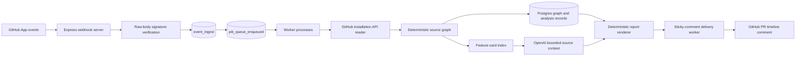
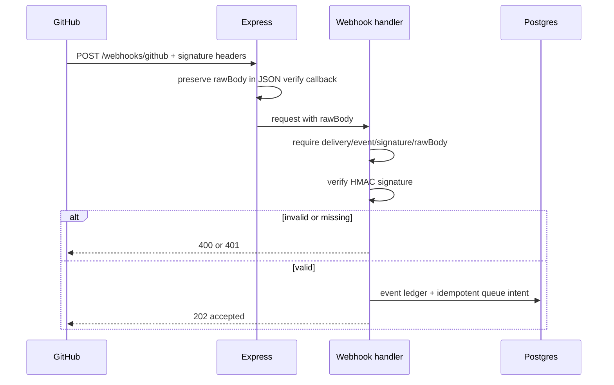
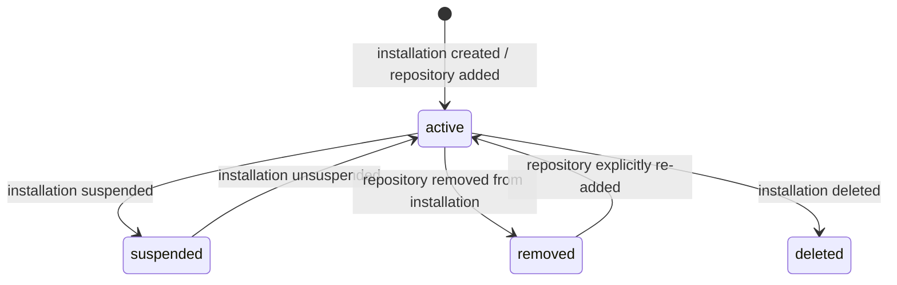
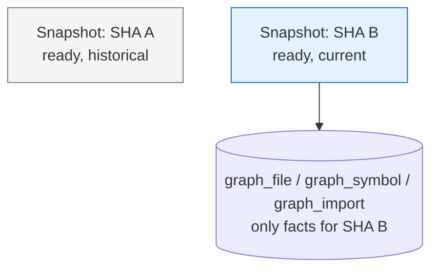
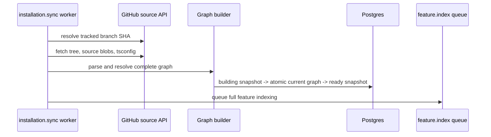
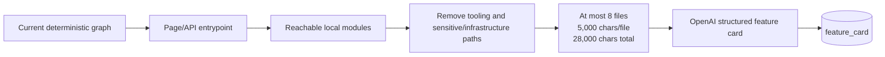
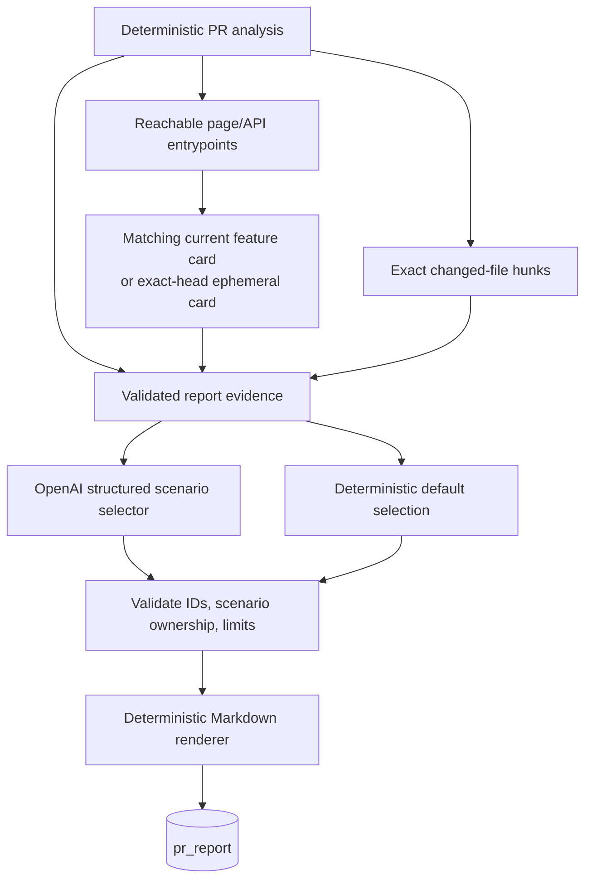
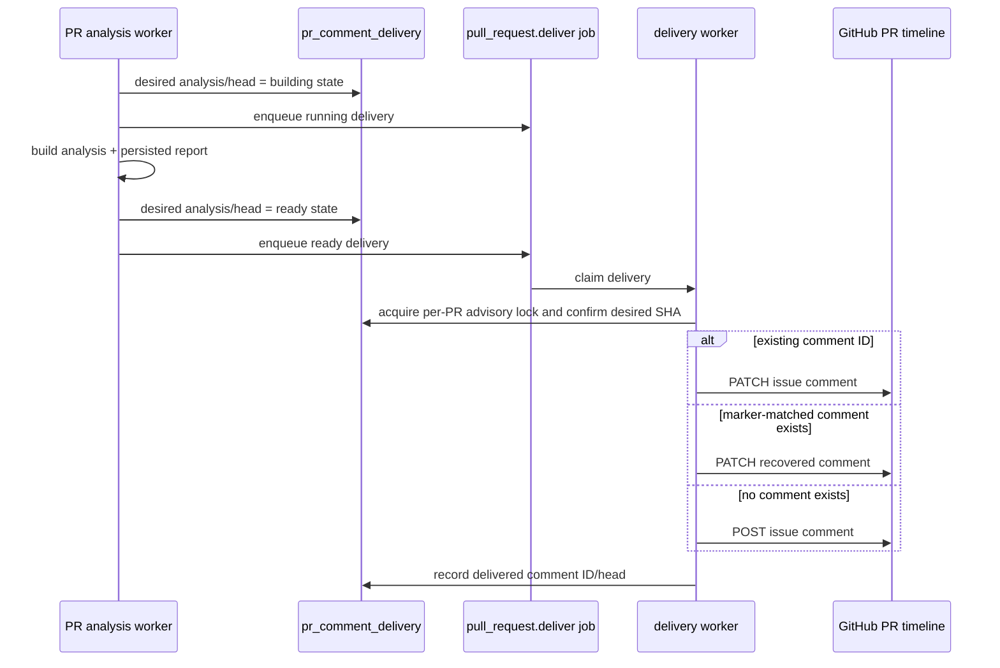
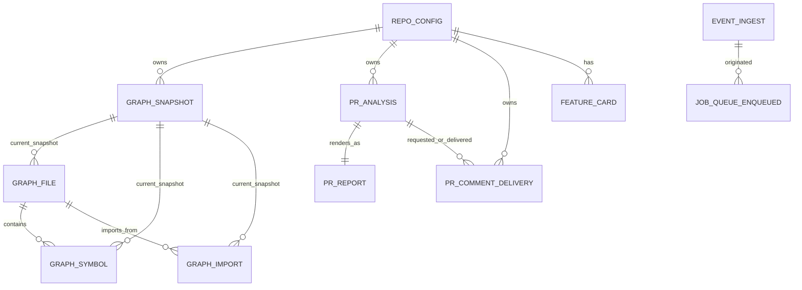

# Impact Analysis Architecture

> **Current implementation:** Phases 1–7. This document describes the code and database model as implemented, including deliberate limitations that remain for Phase 8 and later.

## 1. Product boundary

Impact Analysis is a GitHub App that answers one question before a pull request is merged:

> **What should a developer verify before merging this change?**

It is not a code reviewer, test generator, runtime tracer, or a system that claims a change is broken. It combines deterministic source facts with bounded semantic suggestions:

| Concern | Authority | What it may say |
| --- | --- | --- |
| File changes, symbols, imports, reachable routes | Deterministic TypeScript/source analysis | Facts and verified dependency paths |
| Feature names and user-facing verification scenarios | OpenAI, constrained to supplied source context | Suggestions only |
| Final report wording and evidence paths | Deterministic renderer | Only validated facts and selected scenarios |

The core safety rule is: **AI never establishes reachability or impact.** A route appears in a report only when a resolved file-import path reaches it.

## 2. System at a glance



There are two processes in local development and production:

| Process | Command | Responsibility |
| --- | --- | --- |
| Webhook server | `pnpm dev` | Receives GitHub HTTP requests, verifies them, records/enqueues work, replies `202` |
| Worker | `pnpm worker` | Claims durable jobs and performs graph, analysis, AI, and comment-delivery work |

`MANAGED_QUEUE_KIND=inline` only simulates a provider publish in logs. It does **not** run work in the web server; the worker must still be running.

## 3. Runtime configuration and GitHub permissions

### Environment

| Variable | Used by | Purpose |
| --- | --- | --- |
| `PORT` | server | HTTP port; defaults to `3000` |
| `LOG_LEVEL` | logger | Minimum JSON-log level; defaults to `info` |
| `DATABASE_URL` | Postgres/Drizzle | Durable configuration, queue, graph, analysis, report, and delivery storage |
| `GITHUB_APP_ID` | GitHub readers/writer | GitHub App authentication |
| `GITHUB_PRIVATE_KEY_PATH` | GitHub readers/writer | Path to App private key; loaded locally, never stored in Postgres |
| `GITHUB_WEBHOOK_SECRET` | webhook server | Verifies `x-hub-signature-256` against exact raw request bytes |
| `MANAGED_QUEUE_KIND` | queue adapter | `inline` logs simulated publication; non-inline is a deployment-provider placeholder today |
| `QUEUE_TOPIC_PREFIX` | queue adapter | Log/topic namespace; defaults to `impact-analysis` |
| `OPENAI_API_KEY` | feature cards and report selector | Enables bounded semantic feature/scenario work |
| `OPENAI_MODEL` | OpenAI adapters | Defaults to `gpt-5.6-luna` |

### App permissions and subscriptions

The app subscribes to `installation`, `push`, and `pull_request` webhooks. `installation_repositories` is handled because GitHub sends it when a repository is added to an existing selected-repository installation.

| Permission | Why it is needed |
| --- | --- |
| Metadata: read | Repository identity and default-branch information |
| Contents: read | Git trees, blobs, `tsconfig.json`, and commit comparisons |
| Pull requests: read/write | Pull-request event payloads and sticky timeline-comment delivery |
| Checks: read/write | Reserved for a future check-run integration; not used by the current delivery flow |

Changing the manifest does not upgrade an existing installation automatically. GitHub must approve/re-authorize the installation after a new permission is requested.

## 4. Ingress: webhook authenticity, routing, and queueing

### Why the raw body is captured

Express parses JSON for handlers, but GitHub signs the raw bytes. The `express.json({ verify })` callback copies the unmodified buffer to `request.rawBody` before JSON parsing. The webhook handler verifies that exact string with `@octokit/webhooks` and `GITHUB_WEBHOOK_SECRET`.



Supported events are parsed and validated with Zod before application work is queued. Unsupported event types receive `202` and are logged as ignored; they do not enter the queue.

### Durable idempotency model

`event_ingest` records each GitHub delivery ID and payload SHA-256. `job_queue_enqueued` owns actual work and has a unique deterministic idempotency key. Inserting an event and its queue row happens in one transaction.

This gives two levels of protection:

1. A duplicate webhook delivery does not create a duplicate job with the same idempotency key.
2. A duplicate job that does exist for a later phase reuses a ready graph snapshot, PR analysis, report, or comment pointer rather than duplicating output.

The queue is a Postgres-backed work ledger. Workers claim pending jobs using row locking with `SKIP LOCKED`, set them to `running`, and finally mark them `completed` or `failed` with the last safe error message.

## 5. Repository lifecycle and tracked-branch model

One repository configuration exists per GitHub repository ID (`repo_config`). The MVP tracks **one base branch per repository**, initially GitHub’s default branch.



| GitHub event/action | Repository action | Graph action |
| --- | --- | --- |
| `installation.created` | Store installation, owner/name, default branch, active state | Queue full baseline build |
| `installation_repositories.added` | Resolve/store repository identity and active state | Queue full baseline build |
| `installation.suspend` | Mark repositories inactive/suspended | No graph work |
| `installation.unsuspend` | Reactivate formerly suspended repositories | Queue baseline refresh |
| `installation.deleted` | Mark repositories deleted/inactive | No graph work |
| `installation_repositories.removed` | Mark only those repositories removed/inactive | Sync job records the lifecycle event but does not build |
| `installation.new_permissions_accepted` | Keep active repositories configured | Queue baseline refresh |

`push` and `pull_request` events are ignored when the repository is inactive. They are also ignored when their branch/base branch is not the configured `tracked_branch`. A push to `develop` does not update a repository configured to track `main`.

`semantic_ai_enabled` is per-repository and defaults to true for newly installed repositories. It controls whether bounded source context is sent to OpenAI. It does not affect deterministic graph or PR-impact analysis.

## 6. Source acquisition boundary

`GitHubRepositoryReader` is the only production component that reads installed-repository source. It exchanges the App credentials for an installation token, then uses GitHub APIs to:

- resolve repository owner/name and branch HEAD;
- fetch a complete Git tree at an exact SHA;
- fetch selected file blobs by blob SHA;
- compare `before...after` commits.

Source retrieval is behind the `RepositoryReader` interface. Fixture tests use local source trees/readers rather than GitHub networking.

The graph supports `.ts`, `.tsx`, `.js`, `.jsx`, `.mjs`, `.cjs`, `.css`, `.scss`, `.sass`, and `.less`. A valid root `tsconfig.json` is mandatory even for JavaScript modules, because TypeScript’s compiler resolver is used for module resolution. A repository without a valid root `tsconfig.json` is classified as unsupported rather than producing a partial trustworthy graph.

## 7. Deterministic source graph

### Graph facts

The graph is a typed, file-import graph, not a general graph database and not a call graph.

```mermaid
flowchart RL
  Page[app/s/[publicId]/page.tsx: page] --> Index[components/seller/index.ts: shared module]
  Index --> Review[reviews-section-client.tsx: component]
  Review --> Empty[empty-reviews-state.tsx: component]

  style page fill:#e8f5e9,stroke:#2e7d32
  style Review fill:#fff3e0,stroke:#ef6c00
  style Empty fill:#fff3e0,stroke:#ef6c00
```

For every analyzable file, the builder records:

| Fact | Meaning |
| --- | --- |
| File | Repository path, Git blob SHA, deterministic classification, and classification reason |
| Symbol | Top-level function/class/function-like variable/component candidate, export state, source range, stable key, source hash |
| Import | Importer, optional local target, specifier, static/dynamic/type-only form, resolution status, safe unresolved reason |

Symbols are evidence that a declaration changed. Traversal intentionally remains **file-to-file**: an import proves the importing file depends on the imported file, not that it uses one specific changed symbol.

### Parsing and classification

The TypeScript compiler parses TypeScript and JavaScript with the correct script kind. Its `tsconfig` parsing/resolution honors `baseUrl`, `paths`, JSX, and module-resolution settings.

Classification is deterministic:

| File kind | Recognition rule |
| --- | --- |
| `page` | Next.js App Router `page.*` or Pages Router page convention |
| `api_route` | App Router `route.*` or Pages Router `pages/api/**` |
| `layout` | `layout`, `template`, or `default` App Router boundary |
| `loading` | App Router `loading.*` |
| `error_boundary` | `error`, `global-error`, or `not-found` boundary |
| `metadata` | `robots`, `sitemap`, `manifest`, icon, or social-image metadata convention |
| `component` | JSX in `components/**` or `ui/**`, or an exported React-component candidate |
| `style` | CSS/Sass/Less extension; CSS `@import` is extracted |
| `tooling` | `scripts/**` and recognized framework/build/Sentry/Drizzle config conventions |
| `shared_module` | Other supported code module |
| `unknown` | No reliable rule matched; retained for audit, excluded from product-impact claims |

Component detection includes PascalCase functions, `forwardRef`, `memo`, `lazy`, and certain exported PascalCase aliases. Exports include direct exports, local export lists, renamed exports, and identifier default exports.

### Import resolution statuses

| Status | `to_file_id` | Interpretation |
| --- | --- | --- |
| `resolved` | Set | Local analyzable source/style target; participates in traversal |
| `external` | `NULL` | npm/package import; intentionally outside repository graph |
| `asset` | `NULL` | Local non-graph file, such as a static asset; intentionally outside traversal |
| `unresolved` | `NULL` | Local-looking import could not be found in the target tree; recorded with a reason |

`NULL` therefore does not inherently mean a bug. It is correct for external packages and local static assets. Only `resolution_status = unresolved` contributes to the unresolved-import count.

## 8. Graph storage and freshness

### The deliberate mutable-graph design

Graph storage is intentionally compact during development:

- `graph_snapshot` retains an audit/metrics row for each analyzed `(repo, branch, SHA)`.
- `graph_file`, `graph_symbol`, and `graph_import` contain only one materialized graph: the **current** tracked-branch state.
- A snapshot is `is_current = true` only when it owns those current fact rows.
- Old snapshot metadata remains, but its full graph facts are not retained.

This keeps storage proportional to the current tree rather than multiplying it by every branch commit. It means a historical base SHA is rebuilt in memory when it is no longer the current graph.



`persistReadySnapshot` serializes each repository/branch with a PostgreSQL advisory transaction lock. It rewrites the graph atomically, so readers see the old complete graph or the new complete graph, never a mixture.

### Installation baseline build



The initial build is automatically queued after an installation/repository-add event. The previous manual baseline CLI is no longer required for normal operation.

### Tracked-branch push update

For a tracked-branch push:

1. Resolve the live branch HEAD. If it no longer equals the event’s `afterSha`, the event is superseded and cannot move the current graph backward.
2. Reuse a ready current snapshot for the exact SHA if it already exists.
3. Compare `beforeSha...afterSha`.
4. Incrementally reanalyse changed graph files, reverse dependents of changed/deleted/renamed paths, and importers with previously unresolved local imports when files are added/renamed.
5. Resolve reanalysed imports against the complete target-SHA path set.
6. Retain other facts in memory, then atomically replace the materialized graph.

The update intentionally falls back to a full target-SHA build when comparison is unavailable/incomplete, `tsconfig.json` changed, no suitable base graph exists, or incremental analysis cannot be trusted. A branch deletion (`afterSha` all zeroes) has no valid target graph and is skipped.

## 9. Feature map: bounded user-facing context

The graph proves reachability but does not tell a developer what a page actually does. `feature_card` provides bounded semantic context only for user-facing pages and API routes.



A feature card stores the entrypoint path/kind, source fingerprint, source SHA, status, structured title/description/scenarios, context provenance, model metadata, and any generation failure reason.

The fingerprint hashes the reachable source blob SHAs. A card is reused if its fingerprint still matches, so a push does not resend every route to OpenAI. Full graph builds index all eligible entrypoints; incremental graph updates reverse-traverse from reanalysed paths and refresh only reached pages/API routes. Removed entrypoints have their cards deleted.

### AI-context privacy boundary

Only the selected reachable local modules are sent, subject to the file and character budgets. The system excludes:

- `.env`/environment modules, secret/credential/private-key paths;
- database/Supabase infrastructure;
- email and avatar-storage server utilities;
- cloud, storage, external search, Instagram, rate-limit, phone-constant infrastructure;
- Drizzle/Prisma/Knex configuration; and
- tooling files.

tRPC transport endpoints such as `/api/trpc` are retained in graph facts but are not feature-card entrypoints because they are protocol adapters rather than a user feature.

OpenAI must return strict JSON: title, description, and 1–5 testable scenarios. Every scenario cites supplied `context:N` identifiers. Unknown IDs, malformed output, duplicate scenario IDs, and unavailable context result in an unavailable card—not invented feature claims.

If `semantic_ai_enabled` is false or OpenAI is unavailable, no source is sent to OpenAI. Deterministic analysis/reporting still completes, but no feature-backed scenario is available.

## 10. Pull-request analysis

### Trigger and exact source identity

Only `opened`, `synchronize`, and `reopened` PR actions queue analysis. The PR base branch must equal the repository’s tracked branch.

Each analysis is uniquely identified by `(repo_id, pull_request_number, head_sha)` and stores the exact base/head SHAs. Duplicate deliveries reuse a completed analysis.

```mermaid
sequenceDiagram
  participant PR as pull_request event
  participant Q as pull_request.analyze job
  participant W as analysis worker
  participant GH as GitHub source API
  participant G as graph source
  participant DB as pr_analysis

  PR->>Q: opened/synchronize/reopened
  Q->>W: claim job
  W->>DB: create building analysis
  W->>GH: compare base...head
  alt comparison unavailable/truncated
    W->>DB: insufficient_evidence; no impact claims
  else comparison available
    W->>G: load current base graph if exact SHA matches
    alt base is not current
      W->>GH: fetch exact base and build graph in memory
    end
    W->>GH: fetch required exact-head files/tree
    W->>G: construct complete PR-head graph in memory
    W->>DB: persist deterministic analysis
  end
```

No PR branch graph is persisted. The tracked branch’s mutable graph is used only when it exactly matches `base_sha`; otherwise, the old base and PR head are built ephemerally in memory. Merging the PR later emits a tracked-branch push and makes the merge commit the current branch graph.

### Impact algorithm

1. Compare base/head symbols by stable key and source hash to identify added, modified, and deleted top-level symbols.
2. Seed traversal from every graph-relevant changed file, including import-only/style/add/delete/rename changes even if they declare no symbols.
3. For removed files, use the base graph’s old reverse edges as evidence.
4. Breadth-first traverse only reverse **resolved file-import edges** with stable ordering and cycle protection.
5. Treat the changed file as direct impact; reachable files are indirect.
6. Traverse through all resolved files, but report only pages, API routes, components, and shared modules. Tooling and unknown files are never product-impact claims.

Impact levels are deterministic:

| Level | Rule |
| --- | --- |
| High | Two or more affected pages/API routes |
| Medium | A page/API route was changed, with fewer than two affected entrypoints |
| Low | Other evidence-backed graph change |
| Insufficient evidence | Comparison/source profile/required source is unavailable; no affected-item claims |

An unresolved or external import never fabricates a dependency path. Unresolved imports are counted and exposed as technical evidence.

## 11. Report generation and semantic scenarios

`pr_analysis` is the durable deterministic evidence record. `pr_report` is a separate, regenerable presentation record, uniquely owned by one analysis. Keeping them separate means report/AI delivery failures never rewrite graph facts.



### Evidence rules

Report evidence contains only PR/base/head identity, deterministic impact facts, dependency paths, changed symbols, bounded changed hunks, and feature-card scenarios/provenance IDs. It does not contain a repository dump, full raw diff, database rows, or unverified behavior.

Changed hunks are computed locally from exact base/head blobs, not from GitHub’s optional patch. At most 12 graph-relevant changed files are used; each before/after excerpt is limited to 4,000 characters.

Feature targets are ranked: direct entrypoints first, then shortest verified path, then lexical path; at most five are supplied. A stale tracked-branch feature card is never blindly used for a PR: the system builds exact-head context and either finds a matching fingerprint or generates an ephemeral exact-head card.

### Current selection behavior

The model may select **up to five** targets/scenarios from the evidence. The Markdown renderer displays only selected targets, while the technical evidence keeps all affected items. Consequently, a valid feature target can be absent from the visible suggested-verification section when the model selects fewer targets. This is a current behavior, not missing graph reachability. A planned improvement is to deterministically fill omitted targets when there are five or fewer eligible feature targets.

If selection generation fails, a deterministic fallback selects the first available scenario for each eligible target (up to five). The report remains ready with `llm_status = fallback`; the PR analysis job does not fail.

## 12. Sticky GitHub PR comment delivery

`pr_comment_delivery` is intentionally mutable and unique per `(repo_id, pull_request_number)`. It points to the one GitHub issue/timeline comment for the PR; it does not duplicate the immutable report records for every head SHA.



The body has a hidden marker `<!-- impact-analysis:repo=…:pr=… -->`. It supports recovery if the database pointer is missing and prevents duplicate comments. If GitHub reports the stored comment was deleted, delivery searches for a marker-matched comment, otherwise creates a replacement and repairs the pointer.

The visible comment state is deterministic:

| Analysis state | Comment behavior |
| --- | --- |
| `building` | “Analysis is running” plus head SHA |
| `ready` | Exact persisted Phase 5 Markdown plus base/head footer |
| `insufficient_evidence` | No impact claims; explains evidence is insufficient |
| `failed` | No impact claims; says analysis could not complete for the SHA |

Delivery holds an advisory lock per repository/PR and verifies that the job’s requested analysis/head is still desired. A stale job completes without changing GitHub, so a slow old commit cannot overwrite the newest report. A GitHub delivery error fails only the delivery job/pointer; the report and analysis remain durable and ready for a later retry/re-delivery.

## 13. Postgres data model



| Table | Lifecycle | Purpose |
| --- | --- | --- |
| `repo_config` | Mutable | Installation identity, tracked branch, active/access state, semantic-AI consent |
| `event_ingest` | Append-only | Raw GitHub-delivery audit and payload hash |
| `job_queue_enqueued` | Mutable state | Durable queue intent and job status/attempt/error lifecycle |
| `graph_snapshot` | SHA metadata retained | Build identity, status, mode, counts, duration, current pointer |
| `graph_file` | Mutable current graph | Current source path/blob/classification facts |
| `graph_symbol` | Mutable current graph | Current top-level declaration facts |
| `graph_import` | Mutable current graph | Current forward import edges; reverse lookup uses `to_file_id` |
| `feature_card` | Mutable per entrypoint | Current tracked-branch feature/scenario context |
| `pr_analysis` | Immutable per PR head | Deterministic result for exact base/head pair |
| `pr_report` | Immutable per analysis | Validated evidence, selection, rendered Markdown, model metadata |
| `pr_comment_delivery` | Mutable per PR | Sticky GitHub comment pointer and latest desired/delivered state |

## 14. Failure behavior and honest outcomes

| Situation | System behavior | Claim policy |
| --- | --- | --- |
| Invalid/missing webhook signature data | Reject request `400`/`401` | No work is queued |
| Duplicate webhook/job | Dedupe/reuse durable result | No duplicate graph/report/comment |
| Inactive repository or untracked branch | Ignore event | No analysis/build |
| Deleted tracked branch push | Skip graph snapshot | No target graph claim |
| Stale push after a newer branch HEAD exists | Mark graph update superseded | Never move graph backward |
| Missing/invalid root `tsconfig.json` | Unsupported source profile | PR analysis becomes insufficient evidence |
| Git comparison unavailable or likely truncated | PR analysis becomes insufficient evidence | No affected-item claims |
| Incremental graph comparison unsafe | Full build fallback at exact target SHA | Normal graph facts after fallback |
| Local module genuinely unresolved | Record `unresolved`, no fabricated edge | Exposed as technical count only |
| Feature-card/OpenAI failure | Card unavailable; report falls back deterministically | No invented user scenario |
| Semantic AI disabled | No source/hunks sent to OpenAI | Deterministic report only |
| Report-selector failure | Persist deterministic fallback report | Analysis remains ready |
| GitHub comment API failure | Fail only delivery record/job | Analysis/report are preserved |
| Deleted PR comment | Recover by marker or create a replacement | One repaired sticky pointer |

## 15. Observability and operations

All logs are structured JSON with a timestamp and level. Important correlation fields include GitHub delivery ID, queue job ID, repository ID, PR number, SHA, snapshot ID, comment ID, durations, counts, mode, and safe errors. Report Markdown, full source, private keys, and credentials are not logged.

Useful operational checks:

| Question | Where to inspect |
| --- | --- |
| Was GitHub accepted? | Webhook log and `event_ingest` |
| Was work queued or deduped? | Queue logs and `job_queue_enqueued` |
| Did baseline/push graph finish? | `graph_snapshot` status/current/counts and worker logs |
| Why was a full fallback used? | `graph_snapshot.fallback_reason` |
| What graph is current? | `graph_snapshot.is_current = true` and current graph facts |
| What deterministic PR result exists? | `pr_analysis.result_json` and status |
| What report was rendered? | `pr_report.evidence_json`, `selection_json`, and `markdown` |
| Why is one feature target absent from the visible report? | `pr_report.selection_json` versus `evidence_json.featureTargets` |
| Was the comment delivered? | `pr_comment_delivery` plus `pull_request.deliver` job status |

## 16. Test coverage and current boundaries

The test scripts map to the implemented phases:

| Command | Covers |
| --- | --- |
| `pnpm test` | Phase 1 webhook/queue acceptance fixtures |
| `pnpm test:phase2` | Source classification, resolver, symbols, persistence fixtures |
| `pnpm test:phase3` | Incremental graph and fallback equivalence fixtures |
| `pnpm test:phase4` | Deterministic PR impact traversal/levels |
| `pnpm test:phase5` | Evidence, selection validation, deterministic rendering |
| `pnpm test:feature` | Feature-card context/index behavior |
| `pnpm test:phase6` | Comment-body correctness and identity footer/marker |

The deliberate MVP boundaries are:

- one tracked base branch per repository;
- Next.js/React repositories with a root `tsconfig.json`;
- file-import traversal, not call graphs or symbol-to-symbol bindings;
- no runtime tracing, test generation, security review, or source-code review;
- no GitHub check run or inline review comments;
- no durable generic retry/backoff, automated reconciliation, or full historical graph storage yet.

Phase 7 provides bounded retries, fenced worker leases, tracked-branch reconciliation, deadline controls, queue metrics, and the staging checklist. Phase 8 packages the project for demonstration and submission.

## 17. End-to-end scenarios

### A. First repository installation

1. GitHub sends `installation.created` with accessible repositories.
2. The server verifies the webhook, resolves repository metadata, stores active `repo_config`, and enqueues `installation.sync`.
3. The worker fetches the tracked branch at an exact SHA, parses the full graph, atomically makes it current, and stores snapshot metrics.
4. It queues full feature indexing.
5. Feature indexing creates/reuses bounded page/API cards when semantic AI is enabled.

### B. Push to the tracked branch

1. GitHub sends `push` for `main` (or the configured tracked branch).
2. The worker ensures the event SHA is still the branch’s live HEAD.
3. It compares commits, incrementally reanalyses the required files, and atomically replaces the current graph.
4. It queues incremental feature-card refresh from the reanalysed-path seeds.
5. Future PRs targeting this branch can reuse the resulting graph when their base SHA matches.

### C. PR changes a shared module used by several routes

1. A PR targeting `main` is opened/synchronized/reopened.
2. The analysis worker obtains exact base/head comparison and graphs.
3. Reverse import traversal reaches multiple pages/API routes, so deterministic impact level is High.
4. The report obtains exact-head feature cards and bounded change hunks.
5. It renders suggested verification plus technical paths and persists `pr_report`.
6. The delivery worker creates/updates the one sticky PR comment.

### D. PR base is older than the current tracked graph

1. The tracked branch has advanced beyond the PR’s `base_sha`.
2. Current mutable graph cannot serve as evidence for that old base.
3. The worker fetches/builds the exact base graph in memory and does not persist it as a branch graph.
4. It patches/builds the exact PR-head graph in memory, analyzes, persists only `pr_analysis`/`pr_report`, and leaves the tracked branch graph unchanged.

### E. PR is merged

1. GitHub sends a `push` for the merge commit on the tracked branch.
2. The branch-push worker updates the mutable current graph to the merge SHA.
3. Existing PR analysis/report remains immutable evidence for the original PR head/base pair.

### F. PR gets another commit while an older analysis is slow

1. The newer `synchronize` event creates a newer desired analysis/head in `pr_comment_delivery`.
2. An older delivery job later acquires the per-PR lock and sees it is stale.
3. It completes without overwriting the GitHub comment.
4. The newest ready report becomes the comment body.
